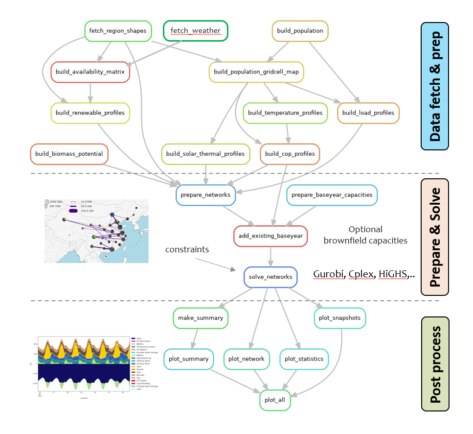

# Welcome to the PyPSA-China (PIK version) documentation!

This is the documentation for the China Python Power System Analysis (PyPSA-China) Model maintained by the Potsdam Institute for Climate Impact Studies' [Energy Transition Lab](https://www.pik-potsdam.de/en/institute/labs/energy-transition/energy-transition-lab). PyPSA-China-PIK is an open model to simulate the future of energy in China at provincial level. Currently, electricity and heat are covered. The model can also be partially coupled to the [REMIND](https://www.pik-potsdam.de/en/institute/departments/transformation-pathways/models/remind) Integrated Assesment Model to obtain multi-sectoral demand pathways.

## Workflow

PyPSA-China-PIK is a workflow built around the [PyPSA](https://pypsa.org/) energy system modelling framework. The workflow consists of gathering and preparing relevant data, formulating the problem as a PyPSA network object, minimising the system costs using a solver and post-processing the data. The workflow is managed by Snakemake. 

## Capabilities

| Capability                | Description                                                                 |
|---------------------------|-----------------------------------------------------------------------------|
| Sectors                   | Models both electricity and heat demand and supply                          |
| Open Data & Code          | Fully open-source model and datasets                                        |
| Provincial Resolution     | Simulates energy systems at the provincial level across China               |
| Renewables & Hydro        | Models renewables and hydroelectricity availability based on historic data using [Atlite](https://atlite.readthedocs.io/en/latest/). Renewables can be split by capacity factor grades                        |
| Storage                   | Long and short-term duration storage with hydrogen, pumped hydro and batteries.                                                                        |
| Coupling with REMIND      | Can be partially coupled to the REMIND IAM for multi-sectoral analysis      |
| Cost Optimization         | Minimizes system costs using a solver of your choice                             |
| Flexible Workflow         | Managed by Snakemake for reproducible and automated analysis                |
| Customizable         | Modular structure can easily be customized                |
| Post-processing Tools     | Detailed results analysis and visualization                                 |

The model has been validated against short term energy trends. Todo: add figure. 

## Key packages 

You may want to look into the [PyPSA documentation](https://pypsa.readthedocs.io/en/stable/), the [snakemake documentation](https://snakemake.readthedocs.io/en/stable/) and the [atlite documentation](https://atlite.readthedocs.io/en/latest/). Atlite is used to generate

## Authors and Credits

This version has is maintained by the PIK team. It is not yet published, please contact us in case you are interested in using the model.

The model is based on the PyPSA-EUR work by the Tom Brown Group, originally adapted to China by Hailiang Liu et al for their study of [hydro-power in china](https://doi.org/10.1016/j.apenergy.2019.02.009) and extended by Xiaowei Zhou et al for their  ["Multi-energy system horizon planning: Early decarbonisation in China avoids stranded assets"](https://doi.org/10.1049/ein2.12011) paper. It has received significant upgrades.

