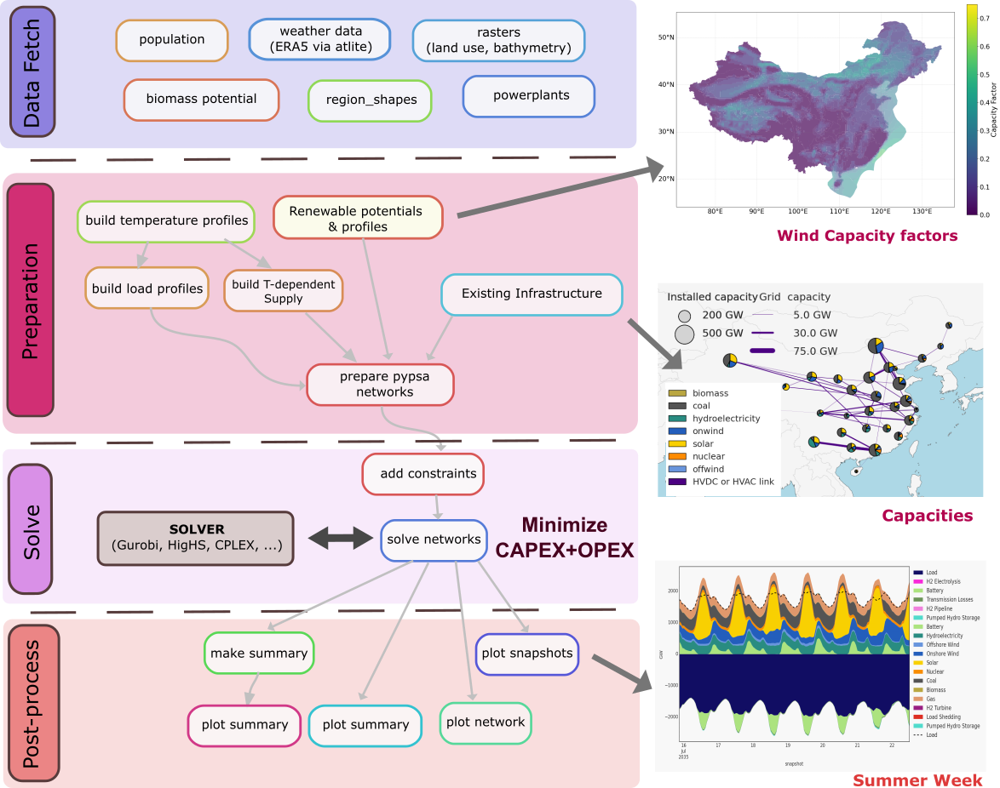
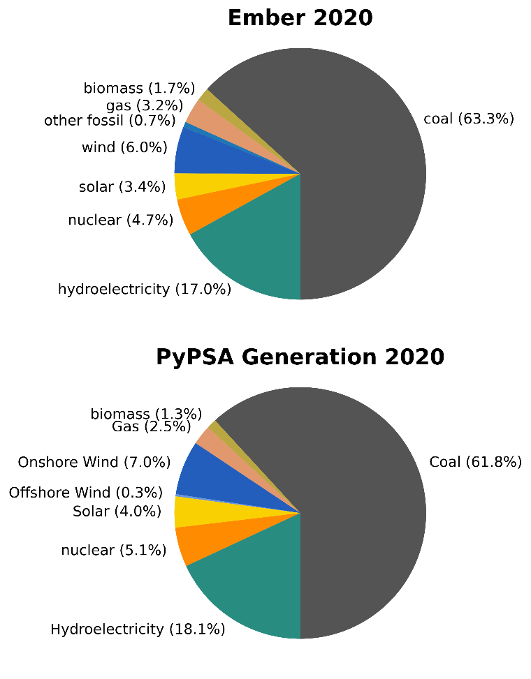

# Summary
Open-source energy system models are essential for understanding and planning future energy systems. They also provide a transparent knowledge basis for evidence-based decision-making [@pfenningerImportanceOpenData2017]. However, such open-source, open-data models remain scarce for China. To address this gap, we present `PyPSA-China-PIK` - a fully open-source, open-data model of China's current and future power sector. The model co-optimizes investments in electricity generation, storage, and transmission capacity, together with their dispatch, to minimize the total cost of supplying electricity and other energy carriers. The optimization is subject to user-defined constraints including environmental policies such as carbon prices or budgets and operational reserve margins to ensure system reliability.

`PyPSA-China-PIK` operates at high spatial and temporal resolution, enabling accurate assessment of the benefits and challenges of energy systems with high shares of variable renewable energy. The model can incorporate results such as capacity expansion decisions and sectoral energy demands from the [REMIND](https://www.pik-potsdam.de/en/institute/departments/transformation-pathways/models/remind) [@baumstarkREMIND2021] Integrated Assessment Model (IAM) as input data. This provides validated energy demand projections under different decarbonization scenarios. Coupling improves the plausibility of long-term transition pathways because, unlike power-system models, IAMs have perfect foresight across all investment periods up to 2100.
The model uses the PyPSA framework[@PyPSA] and builds upon previously published work[@zhouMultienergySystemHorizon2024].

# Statement of need
Internationally agreed climate targets, combined with rapid cost declines and deployment of renewable energy generation and storage, are fundamentally transforming electricity systems worldwide. This is especially true for China - the world's largest power system, largest greenhouse gas emitter but also the global leader in renewable energy installations. Open and transparent modeling is essential to identify transition opportunities, bottlenecks, and challenges. Yet, most studies rely on expensive commercial software (e.g. PLEXOS [@abhyankarAchieving80Carbonfree2022]) or proprietary code (sometimes available on request) and data ([@zhuoCostIncreaseElectricity2022], [@heRapidCostDecrease2020],[@luoCosteffectivenessRemovingLast2025],[@davidsonModellingPotentialWind2016b],[@guoGridIntegrationFeasibility2023]).

To the best of the authors’ knowledge, few fully-open models of China’s power system exist each with provincial resolution. `SWITCH-China`[@heSWITCHChinaSystemsApproach2016a] derives medium-term pathways but has limited temporal detail (two typical days of 6 hour-long time slices per month). The related `CHEER/power` has similar scope and resolution but benefits from incorporating long-term demand projections generated by the CHEER macro-economic model[@anRepositioningCoalPower2025]. Seasonal storage is, however, not implemented. The flexible GridPath framework has also been used (with 6 hour typical days)[@pengRolePumpedHydro2025], whilst RESPO achieves very detailed renewable expansion description by fixing conventional capacities (using closed data) [@zhangSpatiallyResolvedLand2024]. These models do not cover the heat sector, which is strongly coupled to electricity generation through large combined-heat-and-power capacities in Northern China, creating the risk of a coal lock-in[@liuDiversifyingHeatSources2024]. Finally, `PyPSA-China`[@zhouMultienergySystemHorizon2024], on which our model is based, represents the full 8760 hours of the year and covers heat and electricity but with a coarse spatial representation of renewables.

`PyPSA-China-PIK` is a flexible model with hourly and provincial resolution. Key new features include:

-	**Sub-provincial representation of renewable generator capacity and availability**: this avoids smoothing of profiles and capacity factors over large areas. 
-	**Land-use analysis**: land types can be selected for renewable development based on land survey data[@buchhorn2020copernicus].
-	**Coupling [interface](https://github.com/pik-piam/Remind-PyPSA-coupling) to long-term Integrated Assessment model**: REMIND provides long-term sectoral demands and) for improved pathway plausibility.
-	**Operational reserves for contingency planning**
-	**Electric vehicle demand** downscaled from the REMIND & EDGE-T models[@edgeTransport]
-	**Regional fuel costs & subsidy policy implementation**
-	**Combined heat-and power** with realistic heat-to-power ratios
-	**Fully configurable**: no hard-coded variables, all options controlled by `yaml` configuration files.
-	**Extensive reporting**: comprehensive analysis and plotting methods for spatial distributions, time-series, economics and problem duals. 
-	**Data**: automatic data fetches, flexible data replacement and updated existing infrastructure and techno-economics. 
-	**Community focus**: documentation and example configurations to help modelers get started. Code-base streamlined and refocused for collaborative development 
-	**Quality assurance**: automated tests and code formatting/audits and validation of results.
-	**Active development**: higher resolution and further sectors under development.

# Model Overview

`PyPSA-China-PIK` is best understood as a workflow built on-top of the Python Power System Analysis ([PyPSA](https://pypsa.readthedocs.io/en/stable/)) modeling framework[@PyPSA]. The steps  are: 
1.	Data fetch of open energy systems (existing power system infrastructure, weather and land-use) data.
2.	Preparation of a PyPSA least-cost linear optimization problem
3.	Solve with a supported solver (Gurobi, CPLEX, HiGHS) 
4.	Post-process: Analysing & reporting the solution

## Key data
-	Load: the NDRC ministry published provincial peak-valley daily demand data and typical day profiles for each province in 2018. This limits the electrical grid resolution to 31 nodes, which is sufficient for long-term capacity expansion planning (e.g [@wuHourlyElectricPower2023].
-	Land-use availability: from Copernicus land classification[@buchhorn2020copernicus]
-	Weather data is collected from ECMWF’s ERA5 by `atlite`[@atlite2021]. Renewable potentials and hourly availability are aggregated by capacity factor at sub-provincial resolution.
-	Existing power plant capacities from the Global Energy Monitor Integrated Power Tracker[@GlobalIntegratedPower2025]
-	Techno-economic data: costs, lifetimes and efficiencies compiled from literature.

# Functionalities  
The core `PyPSA-China-PIK` functionalities are:
- Co-optimisation of dispatch and investment for electricity generation, transmission and storage down to hourly resolution for a full year for all 31 Chinese mainland provinces and regions.
- Modelling of renewable availability using the `atlite` package [@atlite2021]. Aggregation by capacity factor at sub-node resolution, which is essential for large provinces such as Inner Mongolia.
- Detailed modelling of hydroelectricity based on `atlite` and dam cascades[@liuRoleHydroPower2019]. 
- Co-optimisation of electricity and heat. Heat storage, production and combined heat-and-power generation can be included. There is flexibility to add further energy carriers as done in PyPSA-EUR [@PyPSAEurSec].
-  Transition pathways: informed by IAM scenario results

## Pathways
An advanced feature is incorporating transformation pathways from the REMIND integrated assessment model [@baumstarkREMIND2021] as input data, reflecting long-term demand and investment trends, and evolution of techno-economic parameters including endogenous cost-decreases from learning. This allows embedding the detailed assessment of power system variability, flexibility, and reliability into long-term pathways consistent with climate targets.

# Validation
Unlike in PyPSA, power dispatch in China is not currently based on least-cost principles[@xiangAssessingRolesEfficient2023]. However, upgrades to represent gas-generation in urban areas and differentiated fuel costs mean the model reproduces historical data with high accuracy (figure 2).

# Acknowledgements
This work was made possible thanks to funding from the Energy Foundation China, grant G-2407-35694.
The authors gratefully acknowledge the Ministry of Research, Science and Culture (MWFK) of Land Brandenburg for supporting this project by providing resources on the high performance computer system at the Potsdam Institute for Climate Impact Research. (Grant No. 22-Z105-05/002/001).
We are also indebted to Dr. Fabian Neumann for useful discussions and advice. 

# References