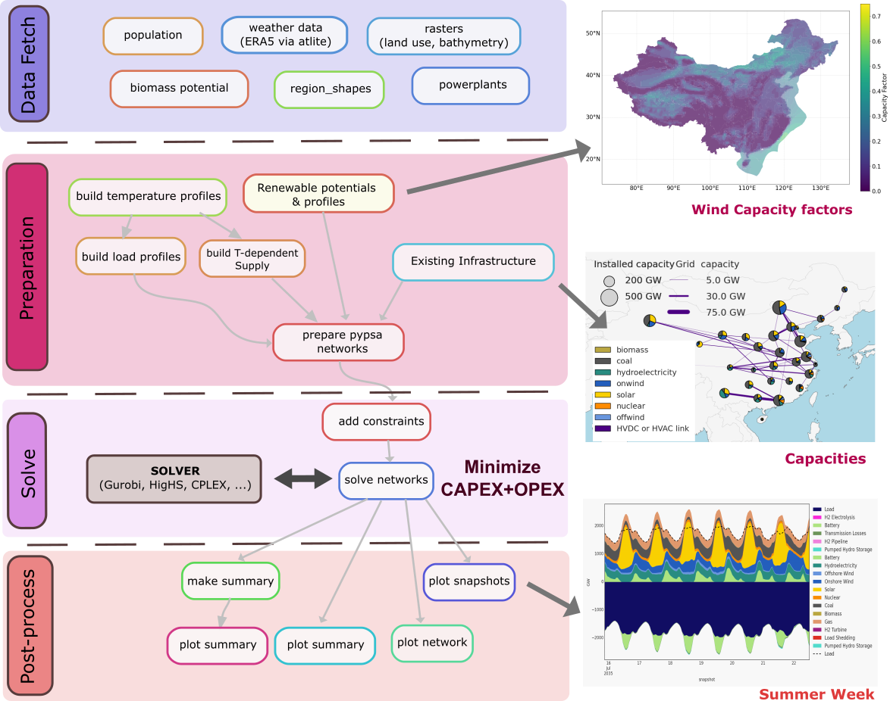

# Summary
Open-source models are essential for understanding and planning future energy systems as they provide a transparent knowledge basis for evidence-based decision-making [@pfenningerImportanceOpenData2017]. However, such models remain scarce for China. `PyPSA-China` addresses this gap by providing a fully open model that co-optimizes dispatch and investments in electricity generation, heat supply, storage, and transmission capacity to minimize the total cost of supplying electricity and other energy carriers. The optimization is subject to user-defined constraints, including environmental policies such as carbon pricing and carbon budgets, as well as operational reserve margins that ensure system reliability.
The model builds on the well-established “Python Power System Analysis” (PyPSA) framework [@PyPSA] and previous publications [@liuRoleHydroPower2019], [@zhouMultienergySystemHorizon2024]. A high hourly temporal resolution, covering a full year, a high spatial resolution for renewable potentials and availability, and a provincial electrical network resolution enable accurate assessment of the benefits and challenges of energy systems with high shares of variable renewable energy. Electricity, electric vehicles and heat provision are currently covered, with additional end-uses such as hydrogen for green industrial goods and air-conditioning under development. A large increase in network resolution will also be released in the near future.

A unique feature is the ability to ingest transformation pathways from Integrated Assessment Models as input data, currently supporting [REMIND](https://www.pik-potsdam.de/en/institute/departments/transformation-pathways/models/remind ) [@baumstarkREMIND2021]. This provides temporally consistent projections of demand, capacities and technology costs under different decarbonisation scenarios. The coupling improves the plausibility of long-term transition pathways because, unlike power-system models, IAMs have perfect foresight across all investment periods up to 2100.

# Statement of need
Internationally agreed climate targets, combined with rapid cost declines and deployment of renewable energy generation and storage, are fundamentally transforming electricity systems worldwide. This is especially true for China - the world's largest power system and largest greenhouse gas emitter, but also the global leader in renewable energy installations. Open and transparent modeling is essential to identify transition opportunities, bottlenecks, and challenges. Yet, most studies rely on expensive commercial software (e.g. PLEXOS [@abhyankarAchieving80Carbonfree2022]) or proprietary code (sometimes available on request) and data [@zhuoCostIncreaseElectricity2022], [@heRapidCostDecrease2020],[@luoCosteffectivenessRemovingLast2025],[@zhangSpatiallyResolvedLand2024],[@guoGridIntegrationFeasibility2023]. Published models rarely include input data and seldom cover key demand sectors: heat provision is strongly coupled to power via extensive district heating networks served by combined heat-and-power plants [@delmastroFutureHeatPumps] but is omitted from power system models. 

`PyPSA-China`’s key features include:

-	**Land-use analysis**: selection of suitable renewable development sites based on high-resolution land survey data[@buchhorn2020copernicus].
-	**Renewable generator grades**: binning avoids smoothing of profiles and capacity factors over large copperplate areas. 
-	**Combined heat-and power** with technology-specific heat-to-power ratios
-	**Coupling [interface](https://github.com/pik-piam/Remind-PyPSA-coupling) to long-term Integrated Assessment model**: REMIND provides long-term sectoral demands, techno-economic data and capacities for improved pathway plausibility.
-	**Electric vehicle demand** downscaled from the REMIND & EDGE-T models[@edgeTransport]
-	**Regional fuel costs & subsidy policy implementation**
-	**Operational reserves for contingency planning**
-	**Fully configurable**: no hard-coded variables, all options controlled by `yaml` configuration files.
-	**Extensive reporting**: comprehensive analysis and plotting methods for spatial distributions, time-series, market values, costs and shadow prices
-	**Open and traceable data**: automatic data fetches from Zenodo and stable stores, up-to-date asset databases and new China-specific techno-economics. Flexibility to use own data 
-	**Community focus**: documentation and example configurations to help modelers get started. Code-base streamlined and refocused for collaborative development 
-	**Quality assurance**: automated tests and code formatting/audits and validation of results.
-	**Active development**: higher resolution and further sectors under way.

# State of the Field: 
Several models of China’s power system exist each with provincial resolution. `SWITCH-China`[@heSWITCHChinaSystemsApproach2016a] derives medium-term pathways but has limited temporal detail (two typical days of 6 hour-long time slices per month). The related `CHEER/power` has similar scope and resolution but benefits from incorporating long-term demand projections generated by the CHEER macro-economic model [@anRepositioningCoalPower2025]. The flexible GridPath framework has also been used (24 typical days with 6-hours each)[@pengRolePumpedHydro2025]. GTEP also uses typical days with renewable supply curves to mitigate the coarse provincial resolution (code available on request)[@zhuoCostIncreaseElectricity2022].
Chen et al. also modelled a full year at hourly resolution, including flexible electric vehicle charging but not heat (closed data and code)[chenPathwayCarbonneutralElectrical2021]. RESPO achieves a detailed description of renewable expansion for a full year by combining provincial electrical network resolution with a very high number of renewable sites, at which supply and demand do not need to be balanced. This required fixing conventional capacities and makes it very challenging to cover other sectors[@zhangSpatiallyResolvedLand2024]. `PyPSA-China` takes a different approach, using a moderate number of renewable sites per electrical node to avoid aggregation effects whilst enabling the co-optimisation of other sectors.
`PyPSA-China-PIKPyPSA-China` was built rather than contributing to existing projects. This is first and foremost  in order to leverage the widely-used and comprehensive `PyPSA` power system modelling framework, which implements lossy optimal power flows in addition to the electricity transport model [@neumannAssessmentsLinearPower2022] and is formulated to cover energy sector. `PyPSA` also interfaces seamlessly with open-source and commercial solversHiGHS. 

# Software design

`PyPSA-China` is designed following these principles: A) Modularity and exten-sibility. We ensure sector-wise modularization, making it straightforward to enable, disable, update or add energy sectors. B) Configurability and trans-parency: we expose all options to users and provide sensible defaults that can be overwritten. Flexible time resolutions make the model accessible with lim-ited computational power. C) Consistency with other PyPSA-workflows: we use the same tools and layout where possible. For example, workflow orchestration is performed by `snakemake` as for `PyPSA-Eur`, `PyPSA-earth` and `PyPSA-USA`[@parzenPyPSAEarthNewGlobal2023],[@PyPSA-Eur],[@PyPSA-USA]. D)Data traceability and customizability: we provide fetch opera-tions to stable stores. We try to ensure custom data can easily be used in-stead of default data. This makes the workflow relevant to modelers with ac-cess to closed-source data.

`PyPSA-China` is not a python module but a workflow. This means it cannot be packaged and distributed via pip but it can be reproducibly set-up with the `conda` environment manager and provided specification files. Future versions will migrate to `uv` or `pixi`.

# Model Overview

`PyPSA-China-PIK` is best understood as a workflow built on-top of the Python Power System Analysis ([PyPSA](https://pypsa.readthedocs.io/en/stable/)) modeling framework[@PyPSA]. The steps  are: 
1.	Data fetch of open energy systems (existing power system infrastructure, weather and land-use) data.
2.	Preparation of a PyPSA least-cost linear optimization problem
3.	Solve with a supported solver (Gurobi, CPLEX, HiGHS) 
4.	Post-process: Analysing & reporting the solution

## Key data
-	Load: the NDRC ministry published provincial peak-valley daily demand data and typical day profiles for each province in 2018. This limits the electrical grid resolution to 31 nodes, which is sufficient for long-term capacity expansion planning (e.g [@wuHourlyElectricPower2023].
-	Land-use availability: from Copernicus land classification[@buchhorn2020copernicus]
-	Weather data is collected from ECMWF’s ERA5 by `atlite`[@atlite2021]. Renewable potentials and hourly availability are aggregated by capacity factor at sub-provincial resolution.
-	Existing power plant capacities from the Global Energy Monitor Integrated Power Tracker[@GlobalIntegratedPower2025]
-	Techno-economic data: China-specific costs, lifetimes and efficiencies compiled from literature.

# Functionalities  
The core `PyPSA-China-PIK` functionalities are:
- Co-optimisation of dispatch and investment for electricity generation, transmission and storage down to hourly resolution for a full year for all 31 Chinese mainland provinces and regions.
- Modelling of renewable availability using the `atlite` package [@atlite2021]. Aggregation by capacity factor at sub-node resolution, which is essential for large provinces such as Inner Mongolia.
- Detailed modelling of hydroelectricity based on `atlite` and dam cascades[@liuRoleHydroPower2019]. 
- Co-optimisation of electricity and heat. Heat storage, production and combined heat-and-power generation can be included. There is flexibility to add further energy carriers as done in PyPSA-EUR [@PyPSAEurSec].
-  Transition pathways: informed by IAM scenario results

An advanced feature is incorporating transformation pathways from the REMIND integrated assessment model [@baumstarkREMIND2021] as input data, reflecting long-term demand and investment trends, and evolution of techno-economic parameters including endogenous cost-decreases from learning. This allows embedding the detailed assessment of power system variability, flexibility, and reliability into long-term pathways consistent with climate targets[@odenwellerREMINDPyPSAEurIntegratingPower2026].

## Pathways
An advanced feature is incorporating transformation pathways from the REMIND integrated assessment model [@baumstarkREMIND2021] as input data, reflecting long-term demand and investment trends, and evolution of techno-economic parameters including endogenous cost-decreases from learning. This allows embedding the detailed assessment of power system variability, flexibility, and reliability into long-term pathways consistent with climate targets.

# Validation
Unlike in `PyPSA-China`, power dispatch in China is not currently based on least-cost principles[@xiangAssessingRolesEfficient2023]. However, upgrades to represent gas-generation in urban areas and differentiated fuel costs mean the model reproduces historical data with high accuracy (figure 2).

# Research impact statement

Demand and community interest for open-source, open-data energy modelling in China is growing rapidly but there remains a lack of truly open models. `PyPSA-China` has already attracted interest with 35 github stars, 3 publica-tions[@lyuIndustrialOvercapacityCan2026a,@liuRoleHydroPower2019, @zhouMultienergySystemHorizon2024] and several papers in preparation. We have also been contacted by 5 research groups in China spanning energy, architecture and social sciences who are using the model. The open-source community-based development model will allow these inter-disciplinary sector experts to improve the current model assumptions and capabilities. There is currently no such platform for China’s energy nexus.

This is a moderate but rapidly growing interest compared to the more estab-lished `pypsa-eur` and `pypsa-earth` projects. These have demonstrated signif-icant research impact, with over 800 citations for the model papers. `PyPSA` has de-factor become core infrastructure for the energy system community with over 2000 github stars. These mature codebases have a large contributor commu-nity and are used by academics, think tanks and industry. A similar level of interest is conceivable in China, where the power system is evolving rapidly and the best models are closed-source. 

# AI usage disclosure

Generative AI tools were used exclusively for minor refactors and accelerating development of CI/CD pipelines. No gen-AI tools were used in the writing of this manuscript, or the preparation of supporting materials. Future version in preparation will have more substantive generative AI tool usage

# Acknowledgements
This work was made possible thanks to funding from the Energy Foundation China, grant G-2407-35694. This work was also supported by the European Research Council (ERC) under the European Union’s Horizon 2020 research and innovation programme (BRIGHT project, Grant Agreement No. 101201472). 

The authors gratefully acknowledge the Ministry of Research, Science and Culture (MWFK) of Land Brandenburg for supporting this project by providing resources on the high performance computer system at the Potsdam Institute for Climate Impact Research. (Grant No. 22-Z105-05/002/001).
We are also indebted to Dr. Fabian Neumann for useful discussions and advice and to Dr. Xiaowei Zhou for answers about his code. 

# References